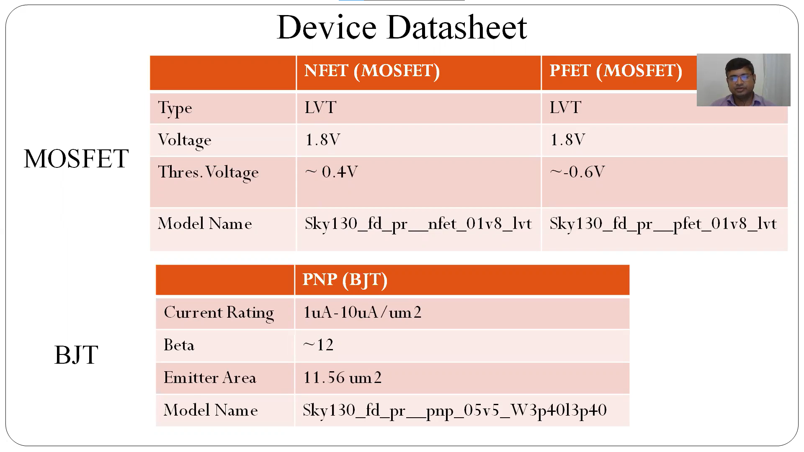
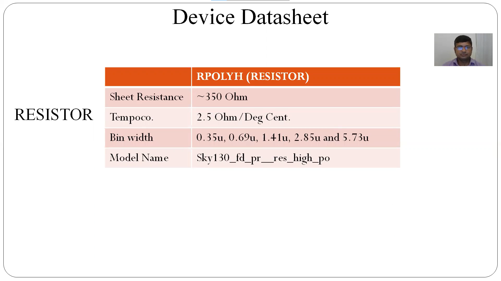

# VSDOpen21 Bandgap Reference Circuit Workshop


This is the report for two day workshop on 
"Analog Bandgap IP design using Sky130 PDK"


# Contents
- [Theory](#Theory)
- [Specification](#Specification)
- [Open Source Tools Used](#Open-Source-Tools-Used)
- [Pre Layout Simulations](#Pre-Layout-Simulations)
- [Layout Design Using Magic](#Layout-Design-Using-Magic)
- [Post Layout Simulations](#Post-Layout-Simulations)
- [LVS Check using Netgen](#LVS-Check-using-Netgen)
- [Report By](#Report-By)
- [Acknowledgements](#Acknowledgements)

# Theory

- Requirement of *reference voltage* independent of 
    - Process
    - Supply Voltage
    - Temprature

** PVT Independent Biasing
- Typical Temperature coefficient : 10-50 ppm/&deg;C
- Typical Power Supply Rejection : 40-60 db 

- Introduction to BGR
    - what is BGR
    - why BGR
    - Applications
    - Principle
        - CTAT (Complementary to Absolute Temperature) circuit compensates PTAT(Proportional to Absolute Temperature)
    - Types
    - Components
        - CTAT
        - PTAT
        - Self-biased current mirror
        - Reference branch circuit
        - Start-up circuit
            - Zero current biasing to desired biasing

 ** Self Biased Current Mirror Based BGR

 # Specification


# Model Used




# Circuit


# Open-Source-Tools-Used

- eSim - For schematic design (not necessary)(netlist can be written as such)
    - https://esim.fossee.in/home

- Ngspice - For simulation
    - http://ngspice.sourceforge.net/


- Magic - For Layout Design 
    - http://opencircuitdesign.com/magic/

- Netgen - For LVS (Layout vs Schematic)
    - http://opencircuitdesign.com/netgen/

- Skywater 130nm PDK
    - https://github.com/google/skywater-pdk-libs-sky130_fd_pr

# Pre Layout Simulation

## CTAT Circuit


## PTAT Circuit

- PTAT is achieved by subracting two different CTATs with different slopes


## Self Biased Current Mirror

## Start-up Circuit


## BGR Circuit with Ideal Opamp


## BGR Circuit with Self Biased Current Mirror(SBCM)


# Layout Design Using Magic


- Points to note
    - Design of resistor involves 4 dummy resistors to make circuit symmetric and stable
    - Use of gauard ring
    - Use of many dummy pnp bjts

The subcells used for the design are
- PNP

- NFETs

- PFETs

- Resistors

- Starter NFET


# Post Layout Simulation

# LVS Check using Netgen
- Note: Remove parasitics during LVS or else LVS will fail

To do lvs in netgen window execute
```
lvs pre_layout.spice post_layout.spice <netgen_rule.tcl>
```

# Report By
- R.V.Rohinth Ram

# Acknowledgements
- Dr. Saroj Rout, Adjunct Prof., SIT Bhubaneswar
- Dr. Santunu Sarangi, Asst Prof., SIT Bhubaneswar
- Kunal Ghosh, Co-founder, VLSI System Design (VSD) Corp. Pvt. Ltd. - kunalpghosh@gmail.com


---
 - Thanks to entire team of this workshop
---